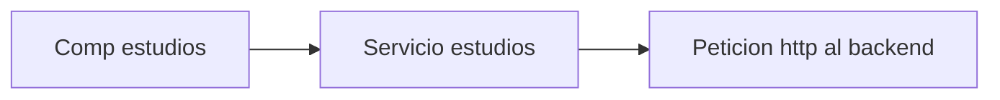

# FrontEnd Argentina programa

Hola! bienvenid@ al frontend de mi portafolio, entregado en la segunda
etapa de argentina programa.

## Introduccion

Para empezar, el portafolio esta pensado para funcionar con el backend tambien alojado en mi github, cuenta con datos de maqueta para que al ejecutar el proyecto no se vea vacio, y se pueda apreciar algo de lo que hace aunque no haya un backend funcionando.

Este frontend esta desarrollado en angular junto con bootstrap (instalado a travez de npm), css, html y typescript.

Cuenta con un modo edicion que funciona directamente con el **backend** de este mismo portafolio, este es un crud que permite añadir, eliminar y editar el contenido de las distintas secciones del portafolio.

## Estructura

El proyecto en si se divide en 2 modulos principales, el modulo de **login** y el modulo **home**

- El modulo **home** contiene varios componentes correspondientes a cada seccion del portafolio (pagina principal, estudios, experiencias, skills, proyectos, etc), esta creado de esta forma por si deseo añadir secciones, simplemente creo un componente y lo llamo a travez del home module.

- El modulo **login** esta creado al mismo nivel que el modulo home, para que al ir al login, se "destruya" el modulo home y tras un inicio de session exitoso, se vuelva a crear con el modo edicion activado.

## Conexiones y funcionamiento

Cada componente funciona de forma *independiente* de los otros modulos, cada seccion cuenta con un servicio encargado de hacer las peticiones crud de su seccion al backend.

>Ejemplo traer datos seccion estudios

esta estructura me facilita conectar un nuevo componente a su propio servicio si deseo añadir secciones en un futuro.

### Funcionamiento interno de cada componente

El servicio, al realizar una peticion get exitosa, recibe un json que contiene un array con objetos, correspondientes a cada seccion. En el caso de estudios, por ejemplo, recibe un objeto que contiene el titulo del estudio, la descripcion y un id
(mas adelante explico como solucione las imagenes)

Este array es enviado a la seccion que, a travez de una plantilla, genera una tarjeta con los datos de cada objeto

>Para que la seccion no tenga tanto codigo html, las distintas plantillas las cree como componentes separados.

como nota adicional, la tarjeta de estudios y la de experiencia utilizan la misma plantilla, pero invertida

### Plantillas

Cada componente (exeptuando estudios y experiencia que usan la misma) utilian una plantilla propia.

como explique antes, la seccion le envia a la plantilla un objeto con los datos del item en si (puede ser un estudio, una experiencia laboral, un proyecto, etc).

#### Imagenes
Las unicas plantillas que integran imagenes (por el momento, no descarto añadir secciones con imagenes), son la plantilla de estudios y la plantilla de proyectos (la foto de perfil no es una plantilla en si, mas detalles abajo).

>La plantilla de estudios solo puede almacenar y/o cargar 1 imagen, mientras que la de proyectos puede almacenar y/o cargar hasta 5, ninguna imagen puede superar 1mb de tamaño

La plantilla recibe el objeto y extrae el id, al crearse el objeto, el html de la plantilla toma esa id y realiza una peticion al backend enviandole por parametro el id del objeto, este le responde con la imagen que tiene guardada en la bdd (el detalle de como almaceno y gestiono las imagenes esta en el readme del backend).

### Secciones sin imagenes

El funcionamiento es *similar* que al de las secciones con imagenes, aqui algunos detalles:

- El navbar tambien es un componente aparte anclado en la seccion mas alta de la pagina, en mobile, los links a las secciones y a las redes se colocan en un menu plegable.

- La seccion principal o pagina principal **no tiene plantilla**, no se pueden eliminar los elementos desde el modo edicion ni tampoco se pueden crear elementos, solo se puede editar la imagen de perfil, nombre, descripcion y titulo.

- La seccion de skills tambien tiene una plantilla que crea la skill, esta no utiliza imagenes, la rueda en si es generada con html, css y typescript.

- El footer al igual que el navbar, en mobile los links a las redes sociales se desaparecen.

## Login

El login es un elemento a la par del home modulo, por lo tanto, si uno se esta mostrando, el otro esta desactivado.

cuenta con su propio servicio que se usa para iniciar y **cerrar** sesio

### Funcionamiento

 Es igual al de cualquier otro login, tras colocar un correo y contraseña, se envia una peticion al backend que, si es correcta, devuelve un token de sesion y un id, sino imprime un mensaje de credenciales invalidas.

 Suponiendo que las credenciales son validas, el token y el id que recibe desde el backend se almacena en el session storage.

 hay una funcion que le informa al home module **si existe un token**.

## Modo edicion
---
En esta seccion explico como funciona el modo edicion del proyecto

### Cambio entre modos

El portafolio cuenta con 2 modos, un modo normal, en el que acceden todas las personas que quieran visitar el portafolio para ver los proyectos o buscar informacion relacionada a alguna de las secciones y el **modo edicion** que solo lo utilizara el administrador o dueño del portafolio para gestionar sus datos.

Para cambiar de modo es necesario **iniciar session correctamente** con correo y contraseña

### Funcionameniento interno del cambio de modos
---
Con los datos que llegan del backend tras un inicio de sesion exitoso (ver funcionamiento del login) se almacenan los datos en el session storage, en el home modulo hay una funcio que comprueba **la existencia** de un token, si existe, se activan los botones del modo edicion

#### Botones del modo edicion
El home informa **a cada componente**, a travez de un input, que el modo edicion esta activado, cada componente cuenta con 2 ng-container, **nunca** estan activos al mismo tiempo, uno contiene el html con la plantilla (el del modo normal) y el otro contienen la plantilla y los botones de **editar**, **eliminar** y **crear** un nuevo elemento.

#### Funcion de los botones 

Los botones solo son un puente entre el **modal encargado de editar** y el componente, al boton le llega el mismo objeto que le llega a la plantilla, con un click, el boton envia y activa el modal de edicion a travez de un servicio.

> En cada elemento creado por la plantilla se crean los botones de editar y eliminar, el boton de crear esta ubicado a la par del div que contiene los elementos creados con la plantilla.

### Modales 

El modo edicion funciona con modales, estos reciben un objeto y se inician segun lo que se quiera hacer

cada seccion cuenta con su propio modal de edicion (las secciones de estudios y experiencia comparten modales)

tipos de modales:

- Creacion: al precionar el boton de crear, se activa un modal vacio, en el se puede añadir los datos que se desee dependiendo de la seccion (Ej en el modal de skills no se puede añadir una imagen, o en el de estudios no se puede añadir mas de 1 foto).

- Eliminar: es el mas simple de los 3, solo recibe una id, y hace una peticion tipo delete a la url del backend correspondiente.

- Edicion: al desplegarse muestra un modal con los datos actuales del item (titulo, subtitulo, imagenes, descripcion).

>Todos los modales menos el de skills, se despliegan utilizando el 100% de la pantalla.

> El modal de edicion y eliminacion de las skills se abre ocupando el total de su contenedor, el de creacion se abre normalmente.

>La pagina principal solo cuenta con un modal de edicion, ya que no se puede crear ni eliminar.

### Seguridad del modo edicion

La seguridad del lado del cliente funciona con el session storage, para peticiones que no sean del tipo get, se debe enviar por headers el id y el token de session.

Si no estas logueado no es posible ver los botones de edicion, si se intenta enviar un token y un id aleatorio, el backend respondera con un "bad credentials" y la pagina se congelara.

Si se inserta por consola un token e id aleatorio al session storage, los botones del crud seran visibles, pero pasara lo del punto anterior.

## Iniciar proyecto

Para empezar, debes clonar o descargar el repositorio de alguna forma

- usando github cli, copia y pega este comando

>gh repo clone GabrielOsOj/frontend_portafolioGB

- puede ir a la parte de code, download zip y se descargara el repositorio completo, luego descomprimalo en una carpeta 

Si no tienes un backend activo, puedes activar las maquetas, estas se activan entrando en src -> enviroment (si solo lo vas a usar en local, cambiar el enviroment que no es de produccion, si lo vas a desplegar con las maquetas, remplazar en el enviroment de produccion)

> modo_sin_backend: true

y para desactivar las maquetas cambiar a false.

> Las imagenes no se veran, seran remplazadas por fotos estaticas
> El login no sera funcional, solo sera visible pero el boton se desactivara

Luego abre una consola de comando dentro de la carpeta donde esta el archivo, y ejecuta:

> ng s

esto desplegara el proyecto de forma local, por defecto, angular utiliza el puerto 4200, para ver la pagina desplegada localmente vaya a su navegador y coloque la url:

> http://localhost:4200/

Si todo funciona correctamente, deberia estar viendo la pagina del portafolio con los archivos de maqueta.

Al no tener un backend funcional, no podra iniciar sesion para ver el modo edicion, en su lugar, abra la consola de su navegador (f12) y coloque un token aleatorio manualmente.

> sessionStorage.setItem("tokken","palabraRamdom");

y para cerrar sesion debe eliminar el token guardado en el session storage

> sessionStorage.clear();

> Esto solo sirve para ver los modales, al intentar guardar los cambios, se quedara todo igual.

### Conexion con backend

Para conectar este frontend con un backend y que funcione correctamente, se deberan respetar las respuestas json, puede saber como deben ser las respuestas si revisa la carpeta assets -> mockParaPortafolio, ahi encontrar los archivos json que se usan como maqueta.

## Conclusion 

Para la creacion de este portafolio y todas sus funciones, tuve que investigar y leer mucha documentacion, tuve errores y los pude solucionar casi todos, asi y todo disfrute mucho hacer este portafolio y el verlo terminado es un gran logro personal, no descarto seguir haciendo cambios en un futuro, asi como agregar funciones, y optimizar el codigo a medida que vaya adquiriendo mas conocimiento en angular.